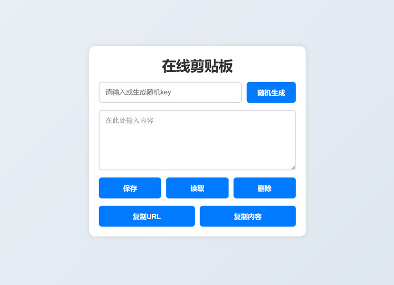

# 在线剪贴板

这是一个简单的在线剪贴板应用，允许用户通过唯一的 `key` 保存、读取和删除文本内容。该应用适用于需要在不同设备之间快速共享文本的场景。

本项目前端为纯静态网页，仅包含一个 `html` 文件，易于部署。后端调用 `netcut.cn` 提供的 API 实现，无服务器成本，并使用加盐算法避免撞库。

### 部署示例

目前，可从以下入口访问该应用的部署示例：

1. 国内：https://zzaiyan.com/netcut

2. 国外：https://zzaiyan.github.io/netcut

各个访问点共享一个后端，因此数据是互通的。

此外，也可以 fork 当前仓库，部署于自己的服务器或 Github Pages 中。

### 使用方法

#### 1. 在线使用

1. 打开应用页面。
2. 输入或生成一个 `key`。
3. 在文本框中输入内容。
4. 点击保存、读取或删除按钮完成相应操作。

#### 2. URL分享

1. 保存内容后，URL 会自动更新为包含 `key` 的形式，例如：  
  `https://example.com/?key=yourKey`
2. 通过分享该 URL，其他用户可以直接访问并读取内容。

### 注意事项

- 每个 `key` 对应唯一的文本内容，请妥善保存 `key`。
- 远程服务器可能有使用限制，请根据提示操作。
